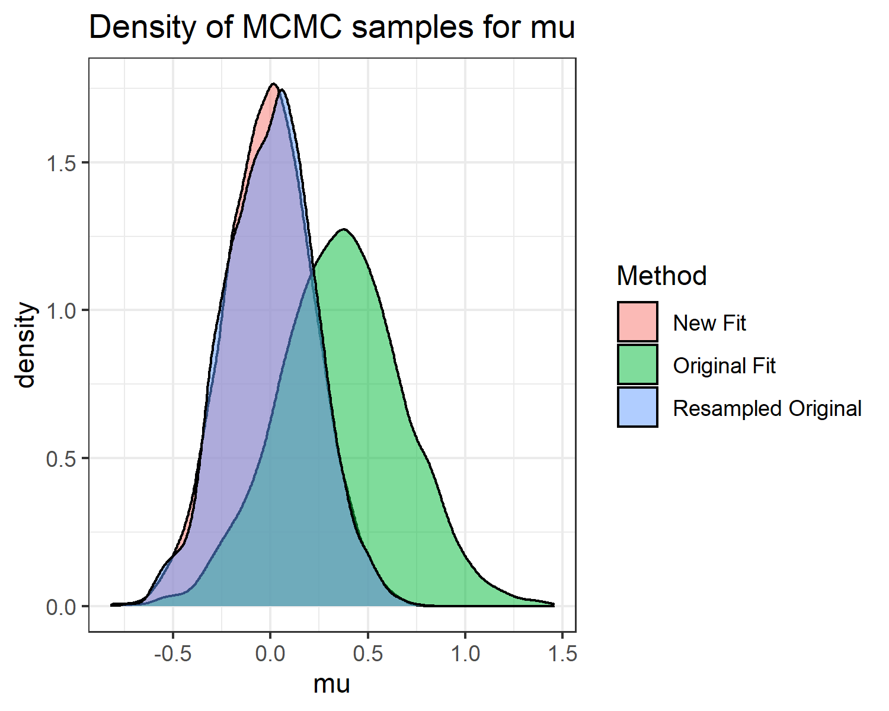

# Incremental Importance Sampling
Basic R package to perform importance sampling to update fitted Stan models with new data

## Installation

```R
install.packages("devtools")
devtools::install_github("codatmo/stanIncrementalImportanceSampling")

```

## Example

```R
library(rstan)
library(stanIncrementalImportanceSampling)
library(ggplot2)

set.seed(0)

#Original data
y1 <- rnorm(10, 0, 1)

#New data is original data plus some extra points
y2 <- rnorm(10, 0, 1)
y2 <- c(y1, y2)

model_code <- "
data {
  int N;
  vector[N] y;
}

parameters {
  real mu;
}

model {
  mu ~ normal(0,10);
  y ~ normal(mu, 1);
}
"

example_model <- stan_model(model_code = model_code)

#Fit with original data
stan_data_original <- list(
  N = length(y1),
  y = y1
)
originalFit <- sampling(example_model, data = stan_data_original)

#Fit with new data for comparison with importance sampling
stan_data_updated = list(
  N = length(y2),
  y = y2
)
newFit <- sampling(example_model, data = stan_data_updated)

#Calculate importance weights
importanceSamplingResults <- importance_sampling(
  originalFit,
  oldData = stan_data,
  newData = stan_data_updated
)

#MCMC samples from original and updated fits
originalSamples <- extract(originalFit)$mu
newSamples <- extract(newFit)$mu

#Use importance weights to resample from original samples
resampledIterations <- sample(
  seq(1,length(originalSamples)),
  replace = T,
  prob = importanceSamplingResults$weights
)
resampledMu <- originalSamples[resampledIterations]

#Data frame for plotting
samples <- data.frame(
  mu = c(originalSamples, newSamples, resampledMu),
  Method = rep(c("Original Fit", "New Fit", "Resampled Original"), each = length(originalSamples))
)

g <- ggplot(samples, aes(x = mu, fill = method))
g <- g + geom_density(alpha = 0.5)
g <- g + theme_bw()
g <- g + ggtitle("Density of MCMC samples for mu")
g
```


